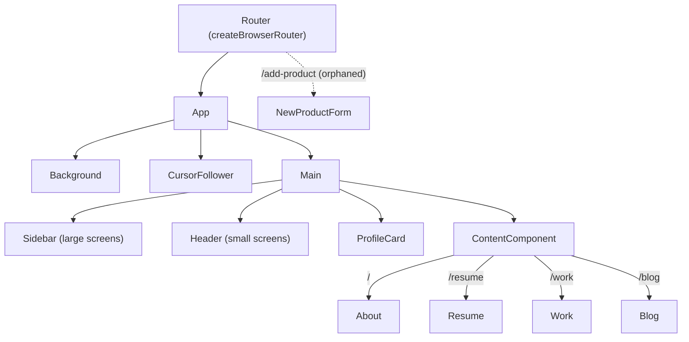

# Portfolio

Arunpragash's personal portfolio website — a single-page React app that presents an About /
Resume / Work / Blog profile for recruiters and visitors, with links out to his projects, blog
posts, and downloadable resume.

Design reference: [ryancv.bslthemes.com](https://ryancv.bslthemes.com/developer/#works)

## Status

**Prototype / actively iterated personal project.** It runs and deploys, but there's no test
suite, no CI, and one dead route left over from an unrelated tutorial (see
[Known Issues](#known-issues)).

## Overview

The app is a single-page portfolio built around a persistent profile card (avatar, tagline,
social links, resume download) and a tabbed content area that swaps between About, Resume, Work,
and Blog panels via client-side routing. It's a personal/practice project rather than a
production product — most of the git history is incremental styling and content passes on one
page.

## Tech stack

- **React 18** + **react-router-dom v6** (`createBrowserRouter`, nested routes, `React.lazy` /
  `Suspense` for code-split panels)
- **Ant Design (`antd`)** + `@ant-design/icons` — primary UI kit (Card, Menu, Layout, Grid
  breakpoints, Timeline, Progress, etc.)
- **Bootstrap 5** — used for a handful of utility classes (`d-flex`, spacing) alongside AntD
- **react-icons**, **react-type-animation** — icon set and the animated tagline on the profile
  card
- **Parcel 2** — primary bundler/dev server (`start`, `build`, `predeploy` scripts all use it)
- **Vite** — a `dev` script exists in `package.json` but there's no `vite.config.*` in the repo,
  so it isn't a working second toolchain (see Known Issues)
- **Deployment**: `netlify.toml` (SPA redirect rule) for Netlify, plus a `gh-pages` deploy script
  for GitHub Pages — two deploy targets are configured

## Features

- About panel with a short bio and a two-column "services" summary (front-end / back-end)
- Resume panel with an experience timeline, education timeline, and skill progress rings
- Work panel linking out to external project deployments/repos (e-commerce site, hostel
  management system, train ticket booking app, a Vercel deployment demo, an e-commerce landing
  page)
- Blog panel linking out to five Medium posts (AWS IAM, MySQL install, Apache/PHP, Git, Java
  architecture)
- Profile card with animated role tagline, social links (GitHub, LinkedIn, LeetCode, Medium,
  WhatsApp), resume PDF download, and a `mailto:` contact button
- Custom cursor-follower effect and an animated vertical-line background
- Responsive layout: a sidebar nav on large screens, a top header nav on small screens (via AntD's
  `useBreakpoint`)
- Route-level lazy loading with a loading spinner (`Loader`) while each panel chunk loads

## Architecture

Everything lives under one page. `App` mounts a fixed background/cursor layer and `Main`, which
lays out the profile card next to a routed content area:



## Folder structure

```
src/
├── App.jsx / App.css       # Root layout: background, cursor effect, Main
├── utils/Router.jsx        # createBrowserRouter route table
├── Components/
│   ├── Main/                # Page shell: sidebar/header + profile card + content
│   ├── Sidebar/, Header/    # Nav (sidebar on lg screens, header below lg)
│   ├── ProfileCard/         # Avatar, tagline, social links, resume download
│   ├── ContentComponent.jsx # Routed <Outlet /> wrapper for the panels below
│   ├── About/, Resume/, Work/, Blog/  # The four routed content panels
│   ├── Background/          # Animated vertical-line background effect
│   ├── Cursor/               # Custom cursor-follower
│   └── Loader/               # Suspense fallback spinner
├── NewProductForm.jsx        # Unrelated POS/admin form, orphaned (see Known Issues)
└── assets/                   # Images and resume.pdf used by the panels above
backup/                        # Old Navbar component + CSS, not imported anywhere (dead code)
```

## Getting started

```bash
npm install
npm start        # runs Parcel dev server against index.html
```

Other scripts (from `package.json`):

```bash
npm run build     # parcel build index.html
npm run predeploy  # parcel build --dist-dir build --no-cache
npm run deploy     # gh-pages -d dist  (publishes to GitHub Pages)
```

Note: `npm run deploy` publishes the `dist` directory via `gh-pages`, while `predeploy` builds
into `build` — the two scripts target different output directories, so run `predeploy`'s build
step manually with `--dist-dir dist` (or adjust one of the scripts) before deploying if you rely
on the `predeploy`/`deploy` pair.

## Known Issues

- **Orphaned admin form bolted onto the portfolio router.** `src/NewProductForm.jsx` is a
  full point-of-sale "create product" form (store/warehouse/SKU/barcode fields, hardcoded
  "John Smilga" as the logged-in user) that has nothing to do with the portfolio. It's still wired
  up at `/add-product` in `src/utils/Router.jsx` and is not linked from any nav — visiting the URL
  directly loads it. Looks like leftover code from a separate tutorial project that never got
  removed.
- **Dead code in `backup/`.** `backup/Navbar/Navbar.jsx`, `backup/Navbar/Navbar.css`, and
  `backup/App copy.css` are old versions of components, not imported by anything in `src/` or
  `script.jsx`. Safe to delete or should be excluded from the repo.
- **Unused heavy dependencies.** `axios`, `styled-components`, and `puppeteer` are listed in
  `package.json` `dependencies` but are not imported anywhere in the source. `puppeteer` in
  particular downloads a full Chromium binary on every `npm install`, which is a significant,
  unnecessary cost for a static portfolio site.
- **`vite` dev script doesn't actually work.** `package.json` has a `dev` script (`vite`) but
  there's no `vite.config.*` anywhere in the repo, and Parcel (not Vite) is what all the
  build/deploy scripts actually use. The `dev` script is effectively dead.
- **Filename case collision in `src/assets/`.** The repo contains both `profile.png` and (per a
  historical `Profile.png`) files differing only by case, which collide on case-insensitive
  filesystems (macOS/Windows) — `git clone` reports "paths have collided" and only one file ends
  up in the working tree.
- **Oversized profile image.** `src/assets/profile.png` is ~16.8 MB, and `Profile_original.jpg` is
  ~6 MB — both are far larger than what a web avatar needs and will slow down first load.
- **No tests and no CI.** There is no test file, test runner config, or `.github/workflows`
  directory in the repo.
- **`predeploy`/`deploy` output-directory mismatch** — see Getting started above.
